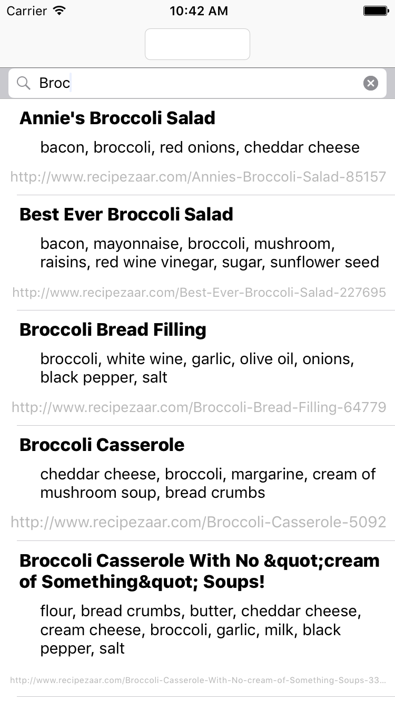

# AC3.2 Mid Unit 5 Assesment
---

Note: Fork master, clone locally, do not edit:

1. Anything in `IndexTableViewController`
2. Anything marked as `DO NOT MODIFY THIS SECTION`
3. You should not need to delete layout constraints that are already provided 

---
### Part 1: Programmatic AutoLayout

#### Design 1: 

**Instructions:**

You must design a layout purely using code (no nibs, no storyboards). See image below. 

**HINTS:**

- You can use any form of programmatic autolayout to do so (`NSLayoutConstraint`, Visual Format Language or `NSLayoutAnchor`)
- Look over the provided `let`s in order to guide your spacing/margin/pt/colors
- It should be obvious where each `let` margin is used in the image
- Vertical spacing between the left/right and "Audio Channels" label is up to you. Just ensure that left/right is centered with respect to their column of views and "Audio Channel" is centered in the view. 


---
#### Design 2: 

**Instructions:**

The layout for our Smitt'n Kitt'n image viewer isn't working. Please fix the missing/incorrect constraints so that the layout matches the screenshot provided and that we can scroll vertically & horizontally on the image. 

**HINTS:**

- Look over the provided `let`s in order to guide your spacing/margin/pt/colors
- You will need to somehow account for the size of the status bar + navigation bar when aligning your top label
- When you view the project in its current state, you are viewing the top-left corner of the imageView


---
#### Design 3: 

**Instructions:**

Snape has just completed his profile on Wizard-Finder.net. You need to ensure that his profile in landscape mode matches the image provided. Currently, the portrait setting is working properly. 


---
### Part 2: Core Data and Nib-backed Table View Cells

**Instructions:**

Populate a Table View with a list of recipes, storing to Core Data. The table's cell must be defined
in a nib file displaying title, ingredients and URL. Two entry fields, one a ```UITextField``` in the
Navigation Bar, the other a ```UISearchBar``` in the table's header must perform the following operations.
The Text Field in the Navigation Bar must initiate queries on the API to bring in new recipes, using 
the text as a query parameter. The Search Bar in the Table View must filter the existing data 
in Core Data without making an API call.

Much of the code is already in place so that you can work on the key elements of the assignment: Core Data 
data modeling and display, and nib-backed Table View Cells.

What's there:

* A Table View Controller class named RecipesTableViewController. It's created programmatically (no nib, no storyboard). 
* The Text Field and Search Bar have been added to the table view and  delegate methods set up to
handle basic interactions with them.
* APIRequestManager 
* Core Data support
* The NSAppTransportSecurity key to allow requests to our http endpoint

What's not there at all:

* The Table View Cell swift and xib files

What's partially there and needs fleshing out:

* The Table View Data Source Delegate methods are in their XCode-generated, basically empty, state. These 
need to be fully defined to display data from Core Data using ```NSFetchedResultsController```.
* A ```NSFetchedResultsController``` property has been partially defined but needs to be fully defined
	in terms of your Core Data model. See comment #1.
* Data captured by the API needs to be populated into your Core Data object. See comment #2.
* The ```initializeFetchedResultsController()``` method has been declared but needs to be completed
and customized to this application. See comment #3.
* The same ```initializeFetchedResultsController()``` method will need to be changed to support 
	filtering from the search bar using an ```NSPredicate```. I recommend getting it working without the filtering first.
	See comments #3 and #4.


For this portion of the assessment, you only need to work inside RecipesTableViewController.swift, the 
Table View Cell nib and swift files you define, the Core Data datamodel file and the extension on the Entity 
object it generates. That's five files total.

#### API

The API is very simple and I've included the endpoint, the data call and the code that seeks to the start of the data array.
You only need to create and populate your Core Data object from the dictionaries that follow this format:

```javascript
{
  "title": "Danish Peppernut Christmas Cookies (Pebernodder)",
  "href": "http://allrecipes.com/Recipe/Danish-Peppernut-Christmas-Cookies-Pebernodder/Detail.aspx",
  "ingredients": "butter, cardamom, cinnamon, cloves, eggs, flour, nutmeg, salt, sugar",
  "thumbnail": "http://img.recipepuppy.com/19913.jpg"
}
````

Include all fields in your model and be sure to handle empty fields, notably the thumbnail.

#### Core Data

Configure your Entity object to be unique on the title field.

#### Table View Cell

Create the ```UITableViewCell``` subclass and its associated XIB. Configure your table to use
it and use automatic table cell heights by configuring the row height on the table appropriately
and by defining the constraints in the Table View Cell correctly.



