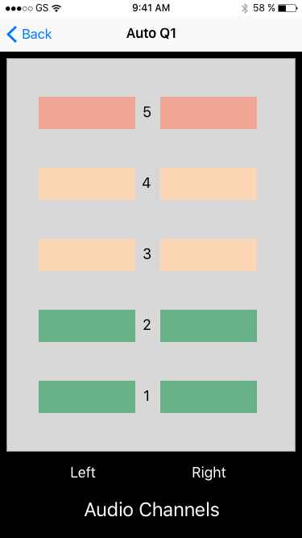
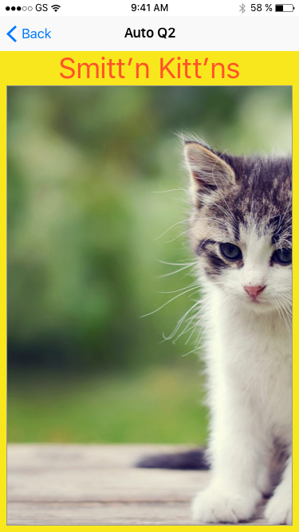
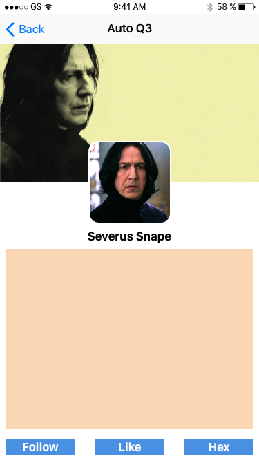
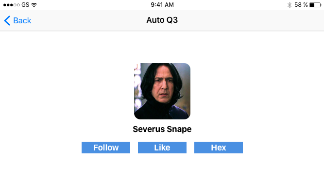

# AC3.2 Mid Unit 5 Assesment
---

Note: Fork master, clone locally, do not edit:

1. Anything in `IndexTableViewController`
2. Anything marked as `DO NOT MODIFY THIS SECTION`
3. You should not need to delete layout constraints that are already provided 

---
### Part 1: Programmatic AutoLayout

#### Design 1: 

**Instructions:**

You must design a layout purely using code (no nibs, no storyboards). See image below. 

**HINTS:**

- You can use any form of programmatic autolayout to do so (`NSLayoutConstraint`, Visual Format Language or `NSLayoutAnchor`)
- Look over the provided `let`s in order to guide your spacing/margin/pt/colors
- It should be obvious where each `let` margin is used in the image
- Vertical spacing between the left/right and "Audio Channels" label is up to you. Just ensure that left/right is centered with respect to their column of views and "Audio Channel" is centered in the view. 

---
#### Design 2: 

**Instructions:**

The layout for our Smitt'n Kitt'n image viewer isn't working. Please fix the missing/incorrect constraints so that the layout matches the screenshot provided and that we can scroll vertically & horizontally on the image. 

**HINTS:**

- Look over the provided `let`s in order to guide your spacing/margin/pt/colors
- You will need to somehow account for the size of the status bar + navigation bar when aligning your top label
- When you view the project in its current state, you are viewing the top-left corner of the imageView

---
#### Design 3: 

**Instructions:**

Snape has just completed his profile on Wizard-Finder.net. You need to ensure that his profile in landscape mode matches the image provided. Currently, the portrait setting is working properly. 

